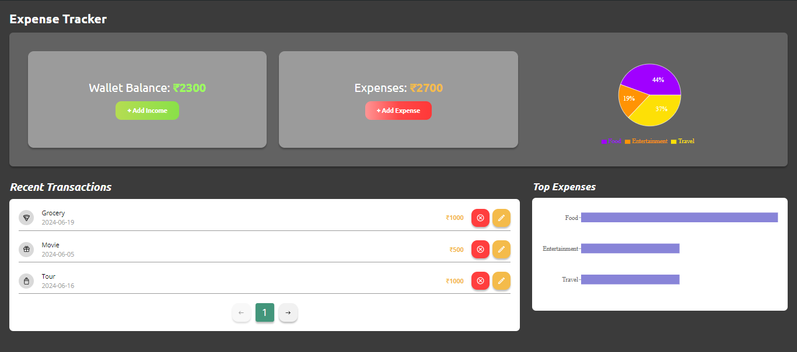

# Expense Tracker
A react application for tracking expenses, allowing users to add, edit, and delete expenses based on category and date, as well as view a summary of their expenses.

Live URL: https://expense-tracker-azure-five.vercel.app/

## Features

- Wallet: Initialize with a balance of 5000; update balance; prevent overspending with alerts.
- Expenses: Add, edit, delete; include title, amount, category, and date; update wallet balance.
- Summary: View expenses categorized by date or type.
- Persistence: Use localStorage for wallet balance and expenses; ensure responsive design.

